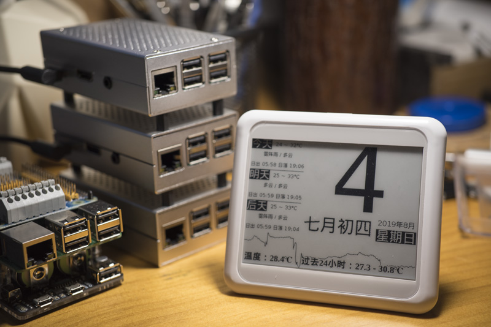
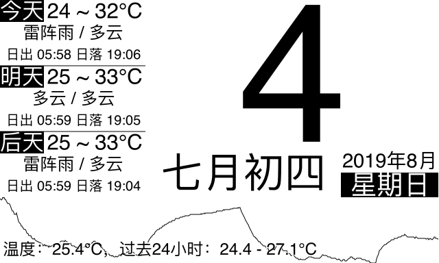
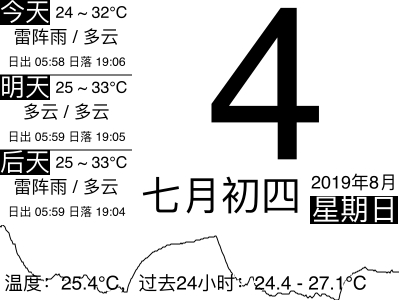
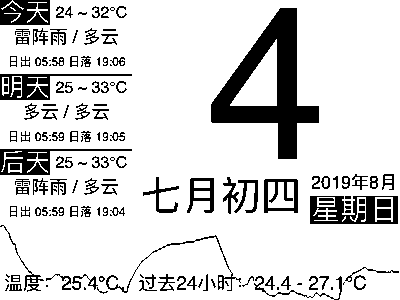
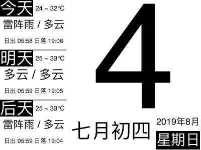

# node-paper-calendar

这是基于NodeJS的提供黑白色天气日历图片服务的程序，用于制作树莓派墨水屏日历，也可以在oled屏幕、lcd屏幕或者其他任何屏幕上使用，理论上兼容任何分辨率（看不看得清楚是另一回事）



```
# 2019年11月13日：
# 近期和风天气SSL证书有点问题，获取天气信息会出错，可在.env中添加以下配置项临时解决：
NODE_TLS_REJECT_UNAUTHORIZED=0
```

```
# 2019年12月18日：
# 最近墨水屏摔坏了，考虑用吃灰的kindle的浏览器去替代前端显示的部分，于是添加了一个首页，访问即可自适应屏幕最大化显示日历，并对竖屏设备自动横屏处理，兼容以往的URL参数
```

## 基本说明

做这个项目之时，我想做的是一个墨水屏展示当前天气、24小时温度曲线及日历的小玩具。市面上可以买到的、提供开发资料墨水屏不外乎大连的、微雪的（其实也是大连的），无论哪一种，作为一个电路苦手，我都不想深入了解其驱动和底层实现，我的思路是：

1. 给树莓派接一个 DS18B20 或者别的基于 1-wired 的温度传感器，因为这类传感器只用接一根GPIO线、并且只需要读取文件就能获取数据，不需要额外写底层代码；

2. 做一个基于 NodeJS 的程序，用于记录温度变化信息、获取天气预报数据，然后生成一张黑白的图片，开启一个 WEB 服务器提供这张图片；

3. 稍微修改一下墨水屏提供的示例程序，让它定时从上一步写的服务中获取图片，然后直接在墨水屏上显示图片，这样一来，无论墨水屏提供的示例代码是基于什么语言的，都不难实现；

## 怎样部署

我设计了两种部署方案：

1. 在树莓派上部署当前项目；

2. 在树莓派上部署一个上报温度数据的服务，然后在另一台服务器上部署当前项目；

程序运行时，会检查当前机器（不论是不是树莓派）上有没有`DS18B20`传感器，如果有的话会每十秒钟读取一次温度，如果没有会继续运行剩下的服务，包括等待其他设备向它上报温度信息；

如果要使用天气预报的服务，你需要去`和风天气`中注册一个账号，获取一个key写入配置文件`.env`中

`.env`的配置项如下：
```
# 服务监听端口
SERIVCE_PORT=3000
# 天气预报的城市或者地区
# https://dev.qweather.com/docs/api/geoapi/city-lookup/ 通过这里的文档调api获取locationId
WEATHER_LOCATION=101020600
# 和风天气的key
WEATHER_KEY=
```

如果你选择在一个树莓派中完成所有事情，那么你可以跳过下面的内容，直接去下一章节。

如果你选择把上报天气的程序部署在别的树莓派上，那么你可以在接入了 DS18B20 的树莓派上部署我的另一个项目：

[rasp-w1-temp](https://github.com/lxrmido/rasp-w1-temp/)

然后在它的`.env`中配置：

```
REPORT_URL=http://当前服务地址:当前服务端口/set
```

如果你选择自己写一个上报温度的程序，或者用其他的、ESP32之类的设备去代替树莓派，那么你需要做的是写一个程序或者SHELL脚本定时向上述配置地址发起一个`POST`请求，在里边传递一个如下的`JSON`数据：

```
{"temp": 27000}
```

表示上报一个27.000度的数据，当然，`temp`这个键值是可配置的，只需要在`.env`中添加：

```
TEMP_KEY=foobar
```

甚至，你可以在获取图片的时候才传递这个参数，程序会同时记录多个不同值的变化信息，来实现同一个程序记录多个设备上报的信息，程序默认会记录最近的`8640`个数据，`8640`这个值的配置项为：

```
CHANGES_LIMIT=8640
```

## DS18B20 的安装方法

DS18B20只有三根线，一根连接`3.3v的VCC`，一根连接`GND`，剩下的数据线连接一个`GPIO`口，默认是`GPIO.7`，也就是树莓派左边一排`GPIO`插针从上往下数的第4个；

执行以下的命令启用单总线协议：

```
sudo modprobe w1-gpio
sudo modprobe w1-therm
```

编辑`/boot/config.txt`，在最下面添加一行：

```
dtoverlay=w1-gpio
```

然后重启树莓派，你能在`/sys/bus/w1/devices/`中看到它；

## 本程序的安装方法

本程序用到了[node-canvas](https://www.npmjs.com/package/canvas)，因此建议你先运行下面的命令去装一些库：

```
sudo apt-get install build-essential libcairo2-dev libpango1.0-dev libjpeg-dev libgif-dev librsvg2-dev
```

然后 clone 本项目，执行 `npm install` 或者 `yarn` 去安装依赖的 `node` 包

然后 `node index` 运行此程序

然后你就能在浏览器上打开 `http://树莓派的IP:部署端口/calendar` 看到一个日历：



这个接口接受以下参数：

|参数|说明|示例|默认值|
|---|---|---|---|
|width|图片宽度|400|640|
|height|图片高度|300|384|
|bit|是否显示为单色BMP|1|0|
|hideWeather|是否隐藏天气信息|1|0|
|hideTemp|是否隐藏温度曲线|1|0|
|tempKey|温度曲线使用的键值|foobar|temp|

譬如把尺寸改为`400x300`：

`http://树莓派的IP:部署端口/calendar?width=400&height=300`



使用单色的BMP输出（可直接加载到墨水屏）：

`http://树莓派的IP:部署端口/calendar?width=400&height=300&bit=1`



隐藏温度：

`http://树莓派的IP:部署端口/calendar?width=400&height=300&hideTemp=1`



隐藏天气：

`http://树莓派的IP:部署端口/calendar?width=400&height=300&hideWeather=1`


隐藏天气和温度：

`http://树莓派的IP:部署端口/calendar?width=400&height=300&hideWeather=1&hideTemp=1`


## 关于数据

程序获取到的数据默认备份在`data`目录下，每次程序运行时将读取到内存中，可通过配置项`DATA_DIR`进行修改，默认每分钟备份一次，备份间隔可通过配置项`BACKUP_INTERVAL`修改

## 其他的一些接口和说明

除了`/calendar`外，这个程序附带了一些其他接口

### 更新若干个键值

接口：`/set`

方法：`POST`

数据格式：`json`

参数示例：

```json
{
    "foo": 123,
    "bar": "456"
}
```

### 获取某个键的最新值

接口：`/get/{key}`

方法：`GET`

调用示例：`/get/foo`

返回值示例：

```json
{
    "value": 123,
    "updated": 12345678901
}
```

### 获取某个键最近8640个值

接口：`/changes/{key}`

方法：`GET`

返回值示例：

```json
{
    "changes": [
        {
            "value": 123,
            "updated": 12345678901
        },
        {
            "value": 122,
            "updated": 12345678900
        }
    ]
}
```

## 获取某个值今天的所有值：

接口：`/today/{key}`

方法：`GET`

返回值示例：

```json
{
    "changes": [
        {
            "value": 123,
            "updated": 12345678901
        },
        {
            "value": 122,
            "updated": 12345678900
        }
    ]
}
```
